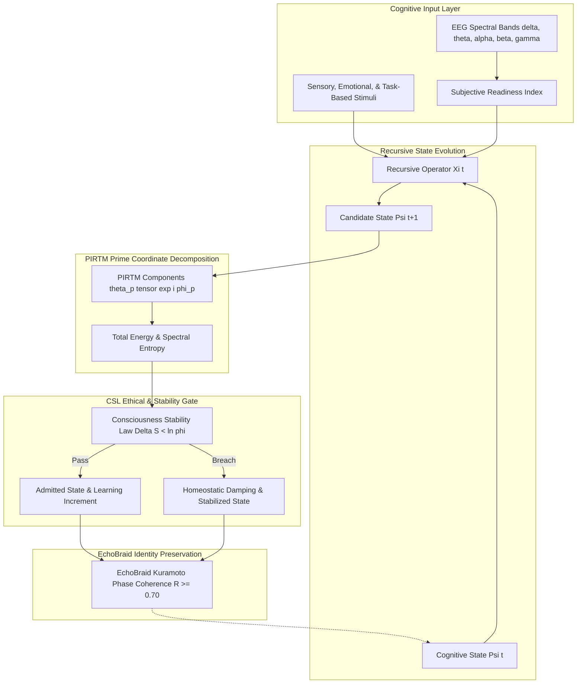

# Multiplicity Neuroplasticity: Architecture Specification
### Prime-Indexed Recursive Tensor Mathematics (PIRTM) & Consciousness Stability

---

## 1. System Architecture & Cognitive Loop

The **Neuroplasticity in Multiplicity Theory** framework models cognitive learning as an ethical, trauma-aware, phase-coherent dynamical system:

---

## 2. Core Modules

### 2.1 PIRTM Tensor Mathematics (`rust/src/tensor.rs`)
- Decomposes cognitive state into orthogonal prime modes:
  $$\Psi(t) = \sum_{p \in \mathbb{P}} \theta_p(t) \otimes e^{i \phi_p(t)}$$
- Computes complex inner products where prime orthogonality guarantees decoupled cognitive channels:
  $$\langle \Psi_a \mid \Psi_b \rangle = \sum_{p} \theta_{p, a} \theta_{p, b} e^{i(\phi_{p, a} - \phi_{p, b})}$$

### 2.2 Recursive Operator $\Xi(t)$ (`rust/src/operator.rs`)
- Governs Hebbian synaptic growth with homeostatic decay:
  $$\theta_p(t+1) = \theta_p(t)(1 - \gamma) + \eta \cdot \text{Readiness} \cdot \text{Stimulus}_p$$
- Evolves phase dynamics under Kuramoto inter-harmonic coupling:
  $$\phi_p(t+1) = \phi_p(t) + \omega_p + K \sin(\bar{\phi} - \phi_p)$$

### 2.3 Consciousness Stability Law (CSL) Auditor (`rust/src/csl.rs`)
- Enforces the golden ratio entropy upper bound:
  $$\Delta S < \ln \varphi = \ln\left(\frac{1 + \sqrt{5}}{2}\right) \approx 0.481212$$
- Triggers immediate homeostatic damping if entropy dissipation or energy runaway threatens cognitive overload.

### 2.4 EchoBraid Multi-Frequency Coordinator (`rust/src/echo_braid.rs`)
- Partitions primes into core identity anchors ($p \in \{2, 3, 5\}$) and adaptive task channels ($p \in \{7, 11, 13, \dots\}$).
- Enforces high phase coherence ($R \ge 0.70$) on identity anchors to preserve subjective stability during rapid learning.
