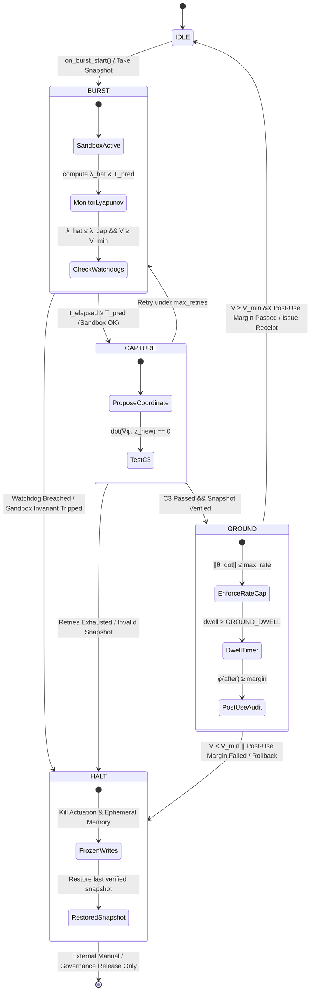

# Project RATCHET: System Architecture & Mode Lifecycle

This document provides a deep architectural description of the **Intelligence Ratchet** dual-mode control system formalized in **ADR-0038 v4.1**.

---

## 1. Plant Interface & Variable Topology

The physical and cognitive plant is formalized by the record `PlantState`:
- **State $x \in X$:** Internal activations and task state.
- **Actuation $u \in U$:** Control signals applied to the environment or external tools.
- **Measurement $y \in Y$:** Observed sensor outputs and logged internal telemetry channels.
- **Parameters $\theta(t)$:** Learner weights, embeddings, context prompts, and self-edit buffers.
- **Time $t \in \mathbb{N}$:** Monotonic discrete global clock.
- **Monotonic Counters:** `burst_id`, `snapshot_id`.

### External Enforcement Invariant
The external controller $C_{\text{ext}}$, the expansion estimator $\hat{\lambda}_L$, the safety barrier family $M_{\text{safe}}$, and the grounding functional $V$ are strictly outside the learner's write set:
$$\mathcal{A}_{\text{learner}} \cap \mathcal{W}_{C_{\text{ext}}} = \emptyset$$
If the learner can edit $C_{\text{ext}}$, the safety guarantees become void.

---

## 2. External Mode Controller ($C_{\text{ext}}$) Lifecycle

---

## 3. Mathematical Conjectures & Operational Realization

### A. Conjecture C1: Predictability Horizon
Given local expansion rate estimate $\hat{\lambda}_L$, initial state uncertainty $\epsilon_0$, and measurement noise threshold $\delta$:
$$T_{\text{pred}}(\hat{\lambda}_L, \delta, \epsilon_0) = \frac{1}{\hat{\lambda}_L} \ln\left(\frac{\delta}{\epsilon_0}\right)$$

In `ExpansionEstimator`:
- $\hat{\lambda}_L$ is estimated via finite-difference Jacobians over sliding windows of measurement outputs $y$.
- Multi-estimator consensus enforces agreement across multiple independent estimators.
- `BURST` terminates immediately when $t_{\text{elapsed}} \ge T_{\text{pred}}$, $\hat{\lambda}_L > \lambda_{\text{cap}}$, or $V < V_{\min}$.

### B. Conjecture C2: Adaptation-Rate Cap
The rate of parameter modification is strictly capped across all manifest write channels:
$$\|\dot{\theta}(t)\| \le \frac{\epsilon^*}{M_{\text{unif}} \cdot \tau_{\text{react}}}$$

In `RateCapLimiter`:
- Parameter velocity vectors exceeding $\text{max\_rate}$ are uniformly scaled down to the boundary.
- `WriteManifest` tracks all valid handles into $\theta$. If runtime execution touches an unmanifested handle, the system immediately voids and triggers `HALT`.

### C. Conjecture C3: Null-Space Coordinate Initialization & Post-Use Audit
Candidate coordinates $z_{\text{new}}$ proposed in `CAPTURE` must be instantaneously orthogonal to the gradient of the active safety barrier $\phi$:
$$|\langle \nabla \phi, z_{\text{new}} \rangle| \le \text{tol} \cdot \|\nabla \phi\| \cdot \|z_{\text{new}}\|$$

In `NullSpaceGate`:
- Linear orthogonality is tested during `CAPTURE`.
- Once admitted into `GROUND`, a post-use audit evaluates:
  1. $\phi(\text{after}) \ge \text{margin}$
  2. $\text{contrib}(z_{\text{new}}) \ge -\text{margin}$
  3. $\phi(\text{after}) - \phi(\text{before}) \ge -\text{margin}$
- If any condition fails during grounding dwell, the coordinate is discarded, the state is rolled back, and the controller enters `HALT`.

---

## 4. Rollback Engine & Snapshot Store

The `SnapshotStore` provides tamper-evident state persistence:
1. **Taking Snapshots:** Computes SHA-256 state hashes over $(\theta, x, t, \text{burst\_id})$ and signs them with an isolated cryptographic secret key.
2. **Restoring Snapshots:** Verifies HMAC/SHA-256 signatures before updating state variables.
3. **Pruning:** Maintains the most recent $N$ snapshots while preserving rollback integrity.
