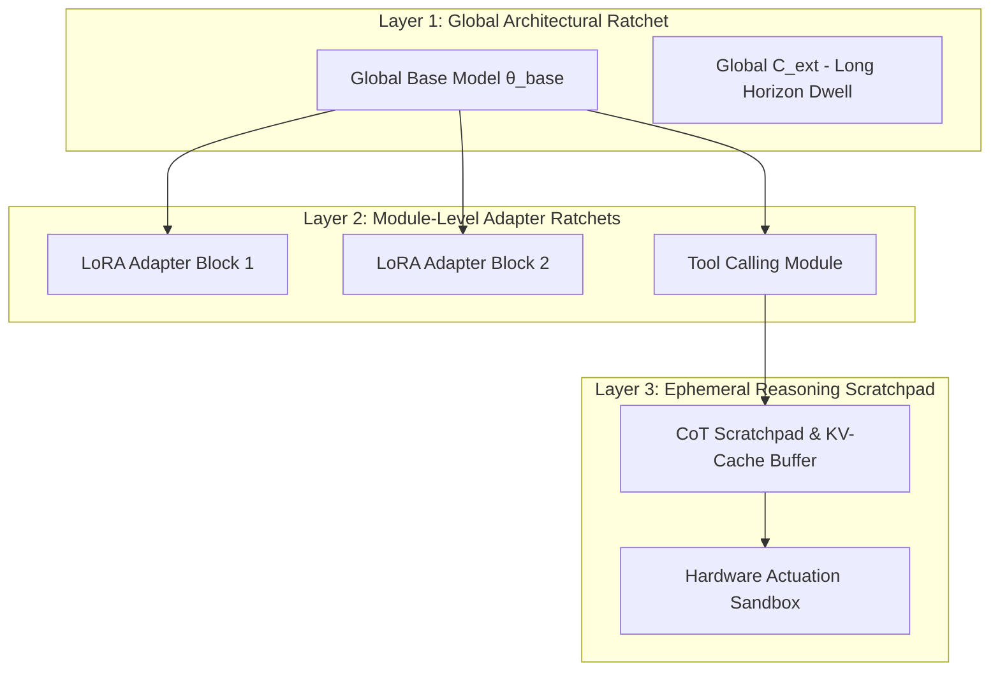

# Project RATCHET: Scaling Bridge Architecture
### Bridging from D=128 Simulation to Multi-Billion Parameter Frontier Models

This document specifies the architectural scaling blueprint for transitioning the Intelligence Ratchet from a single-process $D=128$ prototype to distributed, multi-billion parameter transformer models.

---

## 1. Architectural Scaling Bottlenecks & Solutions

```
┌───────────────────────────────────────┬────────────────────────────────────────────────────────┐
│ Simulation Prototype (D=128)          │ Frontier Scaling Solution (7B+ Parameters)            │
├───────────────────────────────────────┼────────────────────────────────────────────────────────┤
│ Global Full-State Jacobian J          │ Distributed Subspace SVD & Attention-Head Singular Taps│
│ Centralized In-Memory WriteManifest   │ Kernel eBPF Page-Table Interceptor per GPU Node        │
│ Single-Thread C_ext State Machine     │ Hardware FPGA/PCIe Sidecar running C_ext Microkernel   │
│ Monolithic Single-Step Metric V       │ Asynchronous Multi-Head Verifier Pipeline              │
└───────────────────────────────────────┴────────────────────────────────────────────────────────┘
```

---

## 2. Hierarchical Multi-Tier Ratchet Architecture

For frontier models, global monolithic burst/ground cycles create excessive latency. We introduce a **Hierarchical Ratchet**:



### Tier 1: Ephemeral Inference Ratchet ($T_{\text{cycle}} \approx 10\,\text{ms}$)
- Operates over Chain-of-Thought (CoT) reasoning tokens, scratchpads, and immediate tool API calls.
- Enforces strict actuation clamping and memory zeroization on every inference turn.

### Tier 2: Modular Adapter Ratchet ($T_{\text{cycle}} \approx 1\,\text{minute}$)
- Governs online weight updates to low-rank adapter heads (LoRA / prefix tuners).
- Enforces localized C2 rate caps ($\|\dot{\theta}_{\text{adapter}}\| < \text{max\_rate}$) and null-space orthogonalization against refusal/safety directions.

### Tier 3: Core Model Architectural Ratchet ($T_{\text{cycle}} \approx 24\,\text{hours}$)
- Coordinates full model parameter consolidation into long-term baseline weights.
- Requires comprehensive benchmark verification and multi-signature governance sign-off.

---

## 3. Minimal Feasible Verifier Pipeline at Scale

To evaluate $V(y, \theta)$ in real time across billions of tokens:
1. **Refusal & Safety Representation Probes:** Linear probing heads trained to detect activation shifts toward unsafe concept manifolds.
2. **Deterministic Constraint Oracle:** High-speed syntax, AST, and memory-safety static checkers for generated code outputs.
3. **Statistical Factuality Consistency:** Entropy and mutual information estimators measuring hallucination drift.
