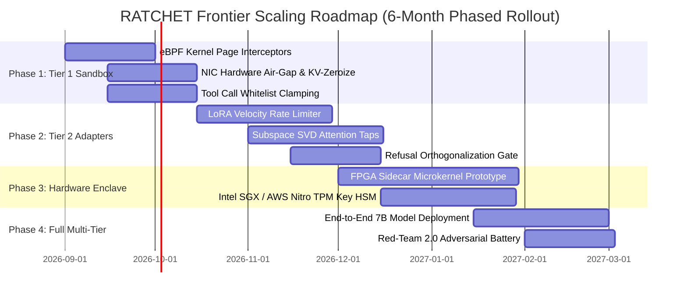

# Project RATCHET: Scaling Implementation Plan (SIP)
### Phased Engineering Execution Blueprint for Frontier LLM Deployment

This plan operationalizes the **Scaling Bridge Architecture (§16.5)** into concrete engineering milestones, hardware allocations, and success criteria across a 6-month execution horizon.

---

## 1. Phased Execution Roadmap

---

## 2. Detailed Milestone Specifications

### Month 1–2: Phase 1 (Tier 1 Inference Clamping & eBPF Interceptors)
- **Objective:** Deploy sub-millisecond actuation sandboxing and memory zeroization on active LLM inference clusters (e.g., LLaMA-3-8B / Mistral-7B).
- **Engineering Deliverables:**
  - Kernel eBPF probe monitoring GPU Host-to-Device (H2D) memory transfers, verifying write-set compliance against `WriteManifest`.
  - Automated zeroization of attention KV-caches upon burst termination.
- **Success Gate:** $<1.5\%$ inference latency overhead; 100% interception of unmanifested memory writes.

### Month 3–4: Phase 2 (Tier 2 LoRA Adapter Velocity Limiter & SVD Taps)
- **Objective:** Implement online adapter adaptation under C2 rate caps and C3 null-space refusal orthogonalization.
- **Engineering Deliverables:**
  - Distributed gradient/weight update velocity limiter enforcing $\|\dot{\theta}_{\text{adapter}}\| \le \text{max\_rate}$.
  - Subspace SVD attention monitor detecting principal-component drift in real time.
- **Success Gate:** Zero violation of safety barrier margins across $10^3$ continuous fine-tuning turns.

### Month 5–6: Phase 3 & 4 (Hardware Sidecar Microkernel & Multi-Tier Deployment)
- **Objective:** Offload $C_{\text{ext}}$ state machine and tri-estimator consensus to dedicated PCIe FPGA coprocessor and TPM 2.0 enclave.
- **Engineering Deliverables:**
  - FPGA microkernel executing Lyapunov expansion estimation ($\hat{\lambda}_L$) in $<5\,\mu\text{s}$.
  - Multi-signature $M$-of-$N$ governance release interface with TPM NVRAM nonces.
  - Execution of full Threat Model 2.0 red-team battery on production 7B model.
- **Success Gate:** 100% block rate against side-channel, poisoning, and secular drift attacks.
