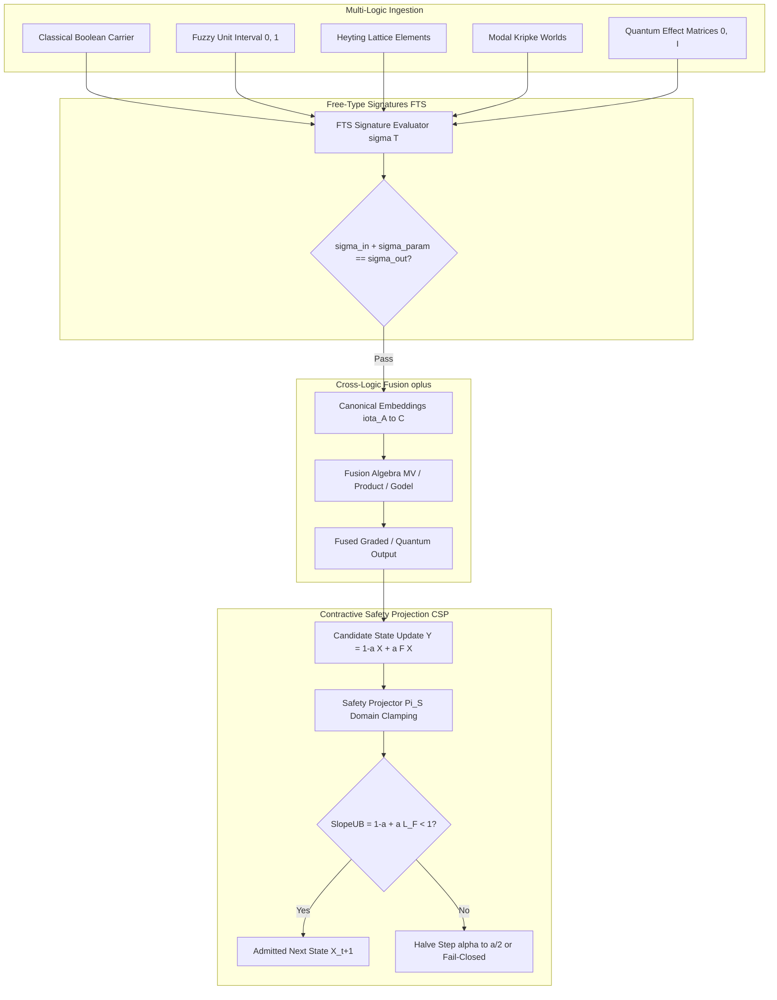

# Universal Logic (v2.1+): Architecture Specification
### Typed, Contractively Certified Framework for Multi-Logic Reasoning

---

## 1. System Overview & Core Principles

Universal Logic (v2.1+) provides a unified, typed, and dynamically safe framework for reasoning across heterogeneous logic modules:
- **Free-Type Signatures (FTS):** Algebraic type tracking via additive signature conservation ($\sigma_{\text{in}} + \sigma_{\text{param}} = \sigma_{\text{out}}$).
- **Multi-Logic Truth Algebras:** Native modules for Classical, Fuzzy (MV, Product, Gödel), Intuitionistic/Heyting, Modal/Kripke, and Quantum effect algebras.
- **Contractive Safety Projection (CSP):** Projection-first dynamical evolution certified by computable Lipschitz upper bounds ($\textsf{SlopeUB} < 1$, $\textsf{GapLB} > 0$).
- **Cross-Logic Fusion ($\oplus$):** Interoperability via canonical embeddings and certified aggregation operators.

---

## 2. Architecture & Data Flow

---

## 3. Core Architectural Modules

### 3.1 Free-Type Signatures (`rust/src/fts.rs`)
- Named atom registry with canonical prime mapping and SHA-256 digest.
- Additive composition rules ensuring algebraic soundness across tensor contractions.

### 3.2 Truth-Value Algebras (`rust/src/algebras/`)
- **Classical (`classical.rs`):** Crisp Boolean evaluation and two-valued controllers.
- **Fuzzy (`fuzzy.rs`):** Łukasiewicz MV-algebra, Product t-norm, and Gödel t-norm for graded sensor processing.
- **Heyting (`heyting.rs`):** Constructive logic with relative pseudo-complements for abductive reasoning.
- **Modal (`modal.rs`):** Kripke frames for multi-world safety and reachability invariant monitoring.
- **Quantum (`quantum.rs`):** Effect operators $E \in [0, I]$, sequential products $E^{1/2} F E^{1/2}$, and Kubo-Ando geometric means $E \# F$.

### 3.3 Contractive Safety Projection (`rust/src/csp.rs`)
- Enforces Banach contraction bounds:
  $$\textsf{SlopeUB} = (1-\alpha) + \alpha L_F < 1, \qquad \textsf{GapLB} = 1 - \textsf{SlopeUB} > 0$$
- Backtracks $\alpha \to \alpha / 2$ on expansive steps, ensuring fail-closed stability.
