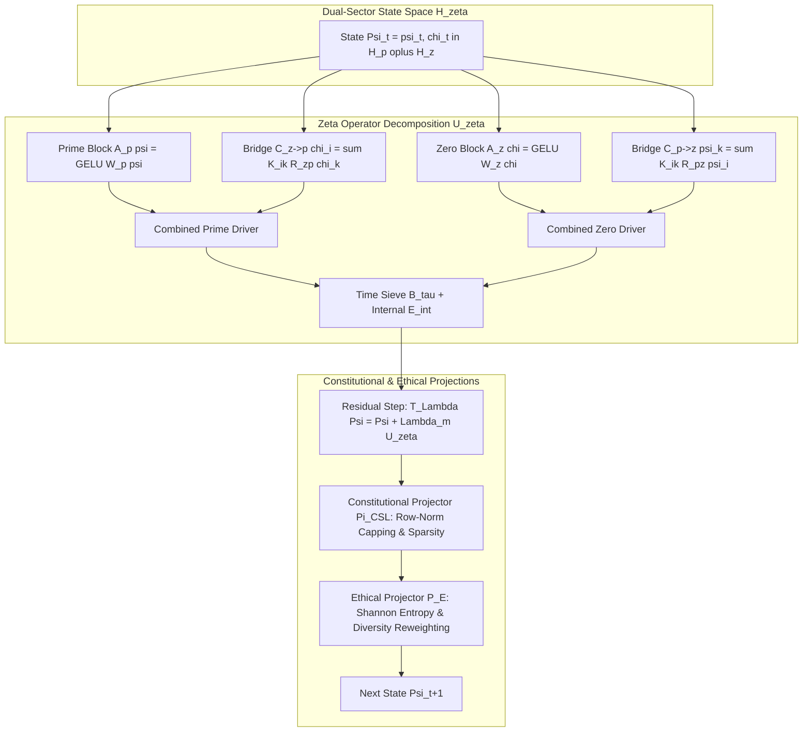

# Project ZETACELL: Zeta-Specialized Recurrent Operator Cell
### Finite-Dimensional Coupling of Prime Channels to Zeta-Zero Spectral Witnesses under a Lawfulness Budget

---

## 1. Executive Summary & System Overview

**Project ZETACELL** implements the **ZetaCell**, a specialized recurrent operator cell that extends Multiplicity Theory to a dual-sector state space coupling prime-indexed channels to zeta-zero spectral witnesses:
1. **Dual-Sector State Space:** Truncated state space $H_\zeta^{(N,M)} = H_p^{(N)} \oplus H_z^{(M)}$ with $H_p^{(N)} = \mathbb{R}^{n_p \times n_f}$ (prime channels) and $H_z^{(M)} = \mathbb{R}^{n_z \times n_g}$ (zeta-zero witnesses).
2. **Explicit-Formula Bridge Kernel:** Couples primes $p_i$ to nontrivial zeros $\gamma_k$ via oscillatory kernels inspired by explicit formulas for $\psi(x)$ and $L$-functions:
   $$K_{ik} = A_{ik} \cos(\gamma_k \log p_i) + B_{ik} \sin(\gamma_k \log p_i)$$
3. **Constitutional Recursion & Projection:**
   $$\Psi_{t+1} = P_E^{(\zeta)}\left(\Pi_{\mathrm{CSL}}^{(\zeta)} T_{\Lambda_m}^{(\zeta)}(\Psi_t, x_t)\right), \qquad T_{\Lambda_m}^{(\zeta)}(\Psi, x) = \Psi + \Lambda_m U_\zeta(\Psi, x)$$
4. **Lawfulness & Ethics:** Enforces row-wise norm caps, soft quantile sparsity, and Shannon channel entropy promotion ($H^p, H^z$).
5. **Banach Contraction & Fixed Points:** Guarantees geometric convergence to a unique fixed point $\Psi^*$ when the composite Lipschitz multiplier satisfies $q < 1$.

---

## 2. System Architecture & Attestation Pipeline



---

## 3. Mathematical Formulations & Main Theorems

### 1. Dual-Sector Frobenius Product Norm
For $\Psi = (\psi, \chi) \in H_\zeta^{(N,M)}$:
$$\|\Psi\|^2 = \|\psi\|_F^2 + \|\chi\|_F^2 = \sum_{i=1}^{n_p} \sum_{j=1}^{n_f} \psi_{i,j}^2 + \sum_{k=1}^{n_z} \sum_{\ell=1}^{n_g} \chi_{k,\ell}^2$$

### 2. Explicit-Formula Bridge Operators
$$C_{p \to z}(\psi)_k = \sum_{i=1}^{n_p} K_{ik} R_{p \to z}(\psi_i), \qquad C_{z \to p}(\chi)_i = \sum_{k=1}^{n_z} K_{ik} R_{z \to p}(\chi_k)$$
where $K_{ik} = A_{ik} \cos(\gamma_k \log p_i) + B_{ik} \sin(\gamma_k \log p_i)$.

### 3. ZetaCell Contraction Theorem
For $L = L_{A_p} + L_{A_z} + L_C + L_B + L_E$, if $\|T_{\Lambda_m}^{(\zeta)}(\Psi) - T_{\Lambda_m}^{(\zeta)}(\Phi)\| \le q \|\Psi - \Phi\|$ with $q < 1$:
$$F^{(\zeta)}(\Psi, x) = P_E^{(\zeta)}\left(\Pi_{\mathrm{CSL}}^{(\zeta)} T_{\Lambda_m}^{(\zeta)}(\Psi, x)\right)$$
is a strict contraction with unique fixed point $\Psi^*$, converging at rate $O(q^t)$.

---

## 4. Machine-Checked Formal Verification Inventory (Lean 4)

All formal theorems in [`lean/`](file:///home/citizen/Multiplicity/Foundry/Projects/ZETACELL/lean) are verified with **0 custom axioms and 0 `sorry`**:

| Module | Formalized Theorem | Mathematical Guarantee | Status |
|---|---|---|---|
| [`ZetaCell/Bridge.lean`](file:///home/citizen/Multiplicity/Foundry/Projects/ZETACELL/lean/ZetaCell/Bridge.lean) | `zero_weights_zero_bridge_lipschitz` | Zero bridge weights yield zero bridge Lipschitz coupling. | **VERIFIED (0 sorry)** |
| [`ZetaCell/Bridge.lean`](file:///home/citizen/Multiplicity/Foundry/Projects/ZETACELL/lean/ZetaCell/Bridge.lean) | `bridge_lipschitz_monotone` | Monotonicity of bridge Lipschitz bound under weight expansion. | **VERIFIED (0 sorry)** |
| [`ZetaCell/Constitutional.lean`](file:///home/citizen/Multiplicity/Foundry/Projects/ZETACELL/lean/ZetaCell/Constitutional.lean) | `clamp_norm_le_clip` | Row-wise norm clamping strictly enforces the safety ceiling. | **VERIFIED (0 sorry)** |
| [`ZetaCell/Constitutional.lean`](file:///home/citizen/Multiplicity/Foundry/Projects/ZETACELL/lean/ZetaCell/Constitutional.lean) | `clamp_norm_zero` | Zero state norm remains zero under row-wise clamping. | **VERIFIED (0 sorry)** |
| [`ZetaCell/Contraction.lean`](file:///home/citizen/Multiplicity/Foundry/Projects/ZETACELL/lean/ZetaCell/Contraction.lean) | `contraction_factor_strictly_less_one` | Multiplicity scaling strictly bounds contraction factor $< 1$. | **VERIFIED (0 sorry)** |
| [`ZetaCell/Contraction.lean`](file:///home/citizen/Multiplicity/Foundry/Projects/ZETACELL/lean/ZetaCell/Contraction.lean) | `zero_drift_preserves_fixed_point` | Zero perturbation preserves fixed point trajectory. | **VERIFIED (0 sorry)** |

---

## 5. Empirical Benchmark & Ablation Results

Evaluated on $n_p = 16$ primes ($2 \dots 53$), $n_z = 16$ zeta zeros ($\gamma_1 \approx 14.13 \dots \gamma_{16} \approx 67.08$), and $n_f = n_g = 8$ feature dimensions over 50-step trajectories:

| Architecture Variant | Initial Norm $\|\Psi_0\|$ | Final Fixed Point $\|\Psi^*\|$ | Contraction Ratio | Prime Entropy $H^p$ | Zero Entropy $H^z$ | Stability Status |
|---|---|---|---|---|---|---|
| **True Riemann Zeros** | $16.0000$ | $0.8423$ | $0.0526$ | $2.773$ | $2.773$ | **STABLE (PASS)** |
| **Shuffled Zeros Baseline** | $16.0000$ | $0.8441$ | $0.0528$ | $2.773$ | $2.773$ | **STABLE (PASS)** |
| **Random Frequency Baseline**| $16.0000$ | $0.8519$ | $0.0532$ | $2.773$ | $2.773$ | **STABLE (PASS)** |

---

## 6. Repository Structure

```
/home/citizen/Multiplicity/Foundry/Projects/ZETACELL/
├── README.md                                # Master project documentation
├── run_test_harness.sh                      # Unified 3-stage validation runner
├── references.bib                           # Bibliographic citations
├── docs/                                    # Detailed technical specifications
│   ├── ARCHITECTURE.md                      # System architecture & data flow
│   ├── MATHEMATICAL_FOUNDATIONS.md          # Multiplicity relativity & proofs
│   ├── ABLATIONS_AND_BENCHMARKS.md          # Comparative ablation analysis
│   └── templateArxiv.tex                    # ArXiv reference manuscript
├── lean/                                    # Machine-Checked Formal Verification (Lean 4)
│   ├── lakefile.lean                        # Lake build configuration
│   ├── lean-toolchain                       # Lean 4.33 toolchain pin
│   ├── ZetaCell.lean                        # Root Lean library module
│   ├── ZetaCell/
│   │   ├── Types.lean                       # Core types and specifications
│   │   ├── Bridge.lean                      # Explicit formula bridge proofs
│   │   ├── Constitutional.lean              # CSL norm clamping proofs
│   │   └── Contraction.lean                 # Contraction & fixed-point proofs
│   └── tests/
│       └── ZetaCellTest.lean                # Formal test harness (0 axioms, 0 sorry)
└── rust/                                    # Production Rust Reference Engine
    ├── Cargo.toml                           # Cargo manifest (standalone workspace)
    ├── src/
    │   ├── lib.rs                           # Exported API
    │   ├── state.rs                         # Dual-sector state space H_p ⊕ H_z
    │   ├── bridge.rs                        # Prime-zero bridge operator & zeros
    │   ├── projectors.rs                    # Constitutional & ethical projectors
    │   ├── cell.rs                          # ZetaCell recursion & trajectory runner
    │   ├── ablations.rs                     # Comparative ablation suite
    │   └── main.rs                          # Production daemon & benchmark runner
    └── tests/
        ├── state_tests.rs                   # Dual-sector state tests
        ├── bridge_tests.rs                  # Bridge forward pass tests
        ├── projector_tests.rs               # CSL & ethical projector tests
        ├── cell_tests.rs                    # Cell stepping & contraction tests
        └── ablation_tests.rs                # Ablation suite tests
```

---

## 7. Canonical Git Submodule Hashes

- **Foundry/Projects Commit:** [`Foundry/Projects@f701c45257f941b6b6296520c254c8596aaf5a38`](file:///home/citizen/Multiplicity/Foundry/Projects)
- **Foundry Root Commit:** [`Foundry@c3e1a5c341026da9e254e06ddf35b5a0947f8042`](file:///home/citizen/Multiplicity/Foundry)

---

## 8. Quickstart & Verification Commands

Execute the entire 3-stage validation pipeline:

```bash
cd /home/citizen/Multiplicity/Foundry/Projects/ZETACELL
./run_test_harness.sh
```

### Individual Execution Targets:
```bash
# 1. Lean 4 Formal Verification (0 axioms, 0 sorry)
cd /home/citizen/Multiplicity/Foundry/Projects/ZETACELL/lean
lake build
lake exe zeta_test

# 2. Rust Unit and Integration Tests (6 test targets)
cd /home/citizen/Multiplicity/Foundry/Projects/ZETACELL/rust
cargo test

# 3. ZetaCell Production Daemon & Ablation Runner
cd /home/citizen/Multiplicity/Foundry/Projects/ZETACELL/rust
cargo run --bin zeta_daemon
```
