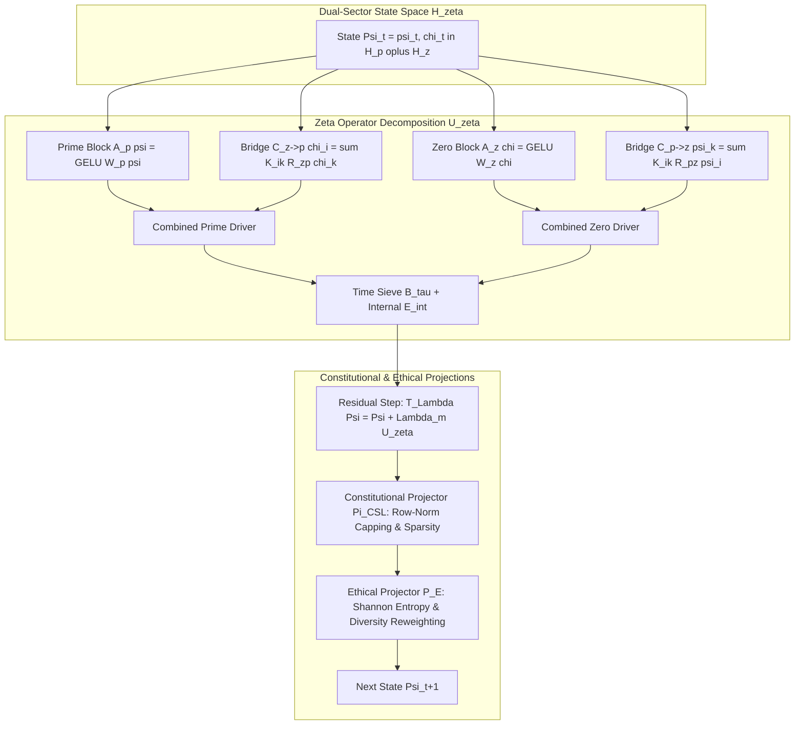

# Project ZETACELL: Architecture Specification
### ZetaCell: A Zeta-Specialized Recurrent Operator Cell
**Finite-Dimensional Coupling of Prime Channels to Zeta-Zero Spectral Witnesses under a Lawfulness Budget**

---

## 1. System Overview & Motivation

The **ZetaCell** extends the MultiplicityCell architecture to a dual-sector state space coupling prime-indexed channels to zeta-zero spectral witnesses. It operates as a finite-dimensional surrogate of a universal multiplicity recursion on a lawful Hilbert space with an explicit lawfulness functional, constitutional projector $\Pi_{\mathrm{CSL}}^{(\zeta)}$, ethical projector $P_E^{(\zeta)}$, and multiplicity constant $\Lambda_m$ controlling contraction.

The central innovation is the **Explicit-Formula Prime–Zero Bridge Operator**, whose kernel is derived from explicit formulas for the prime-counting function and $L$-functions:
$$K_{ik} = A_{ik} \cos(\gamma_k \log p_i) + B_{ik} \sin(\gamma_k \log p_i)$$
where $s_k = \frac{1}{2} + i\gamma_k$ are nontrivial zeros of the Riemann zeta function and $p_i$ are prime numbers.

---

## 2. Architecture & Data Flow

---

## 3. Core Architectural Modules

### 3.1 Dual-Sector State Space (`rust/src/state.rs`)
- $H_\zeta^{(N,M)} = H_p^{(N)} \oplus H_z^{(M)}$ with $H_p^{(N)} = \mathbb{R}^{n_p \times n_f}$ and $H_z^{(M)} = \mathbb{R}^{n_z \times n_g}$.
- Product Frobenius norm: $\|\Psi\|^2 = \|\psi\|_F^2 + \|\chi\|_F^2$.

### 3.2 Prime–Zero Bridge Operator (`rust/src/bridge.rs`)
- Computes oscillatory kernel $K_{ik} = A_{ik} \cos(\gamma_k \log p_i) + B_{ik} \sin(\gamma_k \log p_i)$ with high-precision Riemann zeros $\gamma_k$ and primes $p_i$.
- Maps representations between prime channels and spectral zero witnesses.

### 3.3 Constitutional & Ethical Projectors (`rust/src/projectors.rs`)
- **Constitutional Projector $\Pi_{\mathrm{CSL}}^{(\zeta)}$:** Row-wise norm capping ($\|\psi_i\| \le \text{clip}$, $\|\chi_k\| \le \text{clip}$) and soft thresholding.
- **Ethical Projector $P_E^{(\zeta)}$:** Calculates Shannon channel entropies $H^p, H^z$ and applies temperature-modulated soft weights to promote diversity.

### 3.4 Contraction & Fixed-Point Dynamics (`rust/src/cell.rs`)
- Evaluates update $\Psi_{t+1} = P_E^{(\zeta)}\left(\Pi_{\mathrm{CSL}}^{(\zeta)}(\Psi_t + \Lambda_m U_\zeta(\Psi_t, x_t))\right)$ ensuring geometric convergence to unique fixed point $\Psi^*$.
